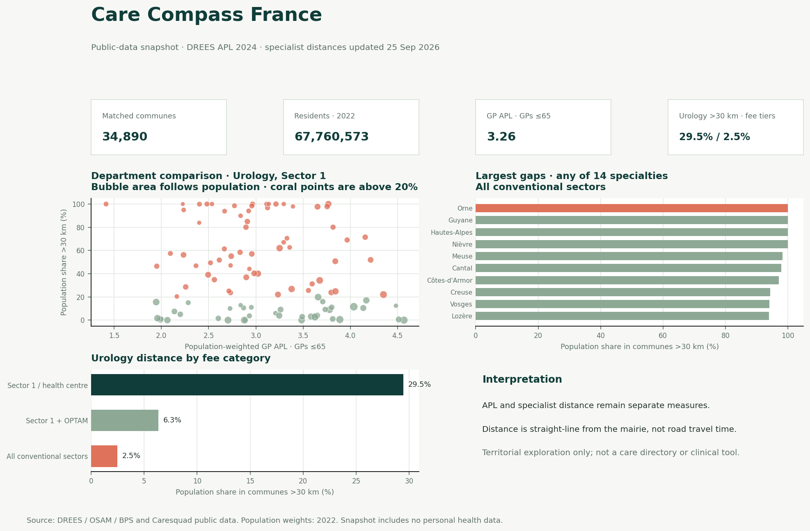
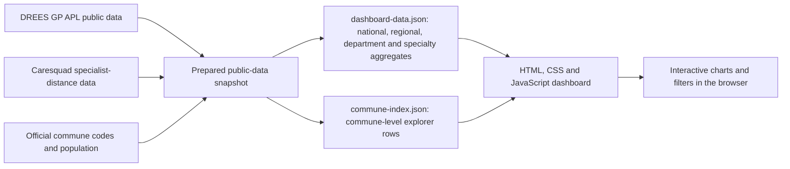

# Care Compass France

Care Compass is an interactive public-data dashboard for exploring estimated GP availability and distance to specialist practices across French communes. It keeps the two measures separate so that a GP availability indicator is not mistaken for a measure of specialist proximity.

**Explore the dashboard:** [Care Compass France](https://imaneelmissaoui.github.io/projects/care-compass/)



## Snapshot highlights

The published JSON snapshot was refreshed with specialist-distance data updated **25 September 2026**. It contains 34,890 matched communes and a 2022 population total of 67,760,573. In the default Urology view, 29.5% of the aligned population lives in communes more than 30 km from a Sector 1 / health-centre site, compared with 2.5% for all conventional sectors.

These are population-weighted territorial indicators from the saved snapshot. The page is static and does not query source APIs in real time.

## Dashboard features

- Filters for region, specialty, and fee category.
- National and regional indicators for GP APL and specialist-distance measures.
- A department comparison chart, a department ranking, and a fee-category comparison.
- A searchable commune explorer that loads its larger detail file only when requested.
- Source links and interpretation limits alongside the dashboard.

## Data flow



The published folder contains the browser dashboard and precomputed JSON snapshots. It does not include the upstream extraction and transformation scripts or a database, so the JSON files are the reproducible boundary of this public bundle.

## Data model

### `data/dashboard-data.json`

| Key | Grain | Contents |
|---|---|---|
| `meta` | One snapshot | Source reference dates, coverage, weighting and interpretation notes |
| `national` | One national row | Matched communes, population, weighted GP APL and combined-specialty indicators |
| `national_specialties` | 14 rows | National distance shares by specialty and fee category |
| `regions` | 17 rows | Region-level APL, population and combined-specialty indicators |
| `region_specialties` | 238 rows | Region-by-specialty distance shares |
| `departments` | 100 rows | Department-level APL, population and combined-specialty indicators |
| `department_specialties` | 1,400 rows | Department-by-specialty distance shares |

### `data/commune-index.json`

This file stores a `columns` array and 34,890 row arrays. Commune codes remain strings to preserve leading zeros.

| Column | Meaning |
|---|---|
| `code_commune` | INSEE commune code |
| `commune_name` | Commune name |
| `department_code` | Department code |
| `population_2022` | Commune population used for distance-share weighting |
| `apl_gp_u65` | GP APL for GPs aged 65 or younger |
| `specialties_over_30km_no_fee` | Count of specialties beyond 30 km under Sector 1 / health-centre fee category |
| `specialties_over_30km_optam` | Count beyond 30 km under Sector 1 + OPTAM |
| `specialties_over_30km_all_sectors` | Count beyond 30 km across all conventional sectors |
| `no_road_connection` | Flag retained for a road-link review in the explorer |

## Measures and methodology

- GP APL (Accessibilité potentielle localisée) estimates local primary-care availability using standardized population and activity information. The displayed aggregate focuses on GPs aged 65 or younger.
- Specialist distance is the straight-line distance from each commune's mairie to the nearest listed practice in the source extract. A distance above 30 km is a territorial threshold, not an estimate of travel time.
- Distance shares are population-weighted with 2022 population. APL uses the source's standardized population measure. The weights are not interchangeable.
- Fee categories remain separate: Sector 1 / health centre, Sector 1 + OPTAM, and all conventional sectors.
- The commune join uses official INSEE commune codes rather than commune names.

## Run locally

The dashboard is static. Serve the folder over HTTP so the browser can fetch its JSON files:

```bash
cd projects/care-compass
python -m http.server 8000
```

Then open [http://localhost:8000](http://localhost:8000). The larger commune explorer file is fetched only after clicking **Load commune explorer**.

To refresh the dashboard, regenerate `data/dashboard-data.json` and `data/commune-index.json` from the source datasets using the same code, joins, weighting rules, and schema. Those upstream transformation scripts are not included in this folder; the published page currently reads the saved snapshot.

## Sources

- [DREES — Access to primary care in 2024](https://drees.solidarites-sante.gouv.fr/communique-de-presse-jeux-de-donnees/jeux-de-donnees/260722-accessibilite-aux-soins-de-premier-recours-en-2024)
- [Caresquad — Specialist access by commune](https://www.data.gouv.fr/datasets/acces-aux-specialistes-de-ville-sans-depassement-dhonoraires-par-commune)
- [French administrative geography API](https://geo.api.gouv.fr/)

Source reuse is credited on the dashboard under Licence Ouverte / Open Licence 2.0. No personal health records are used.

## Limitations

- A straight-line distance from a mairie is not road distance or journey time.
- The source data do not show whether a practitioner accepts new patients or how soon an appointment is available.
- Public-hospital outpatient specialist clinics are not represented in the specialist-distance measure.
- Fee categories do not show an individual's bill or actual affordability; non-contracted doctors are excluded.
- This is a territorial exploration tool, not a care directory or a clinical decision tool.
